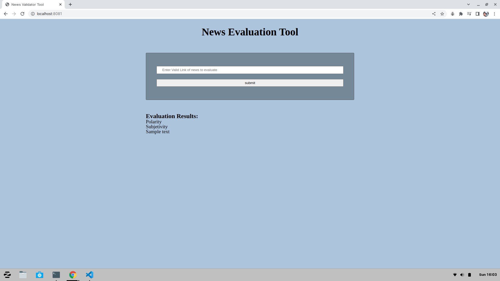
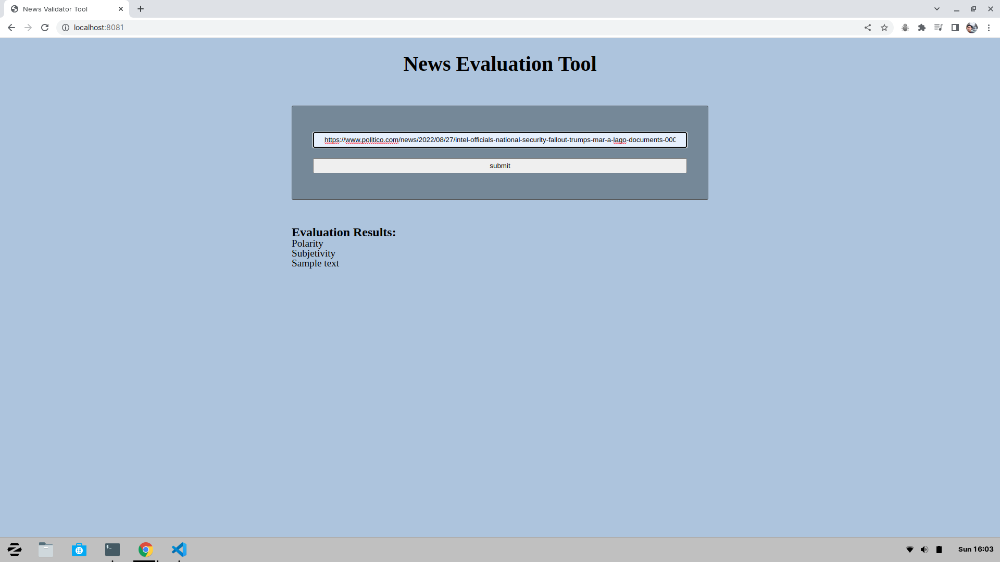
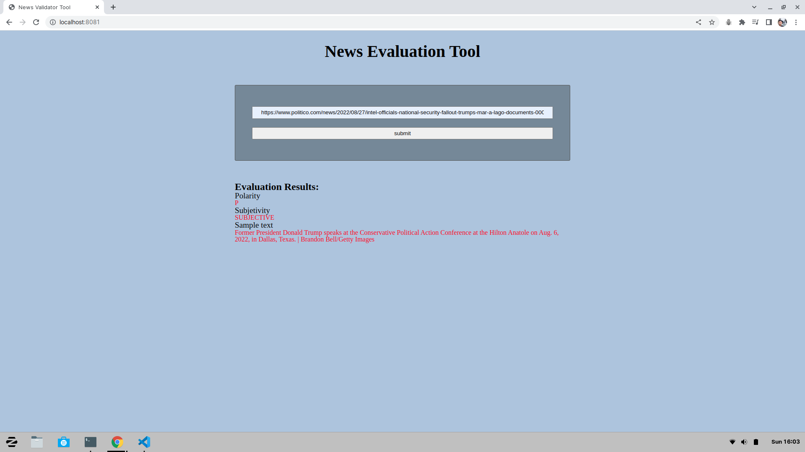

# Project description
### This app analyse any news article from a provide link

1. the user enters a link on a form  and then the client makes a call to the internal server

2.  the internal server makes a fetch request to the meaning cloud  Sentiment Analysis API version 2 and then the Api returns a response with the results for the client to display to the user.
   

## Node and webpack version used
In order to avoid depencecies problems while installing packages use node v14 and webpack 4 and the command npm i --legacy-peer-deps

## How to check node version installed
I'm using Zorin os, a distro of Linux os, and this is what it worked on my system.
to check node version  
Open up the terminal and type node -v
To change your node version, Install nvm(Node Version Manager). Once installed, to switch versions it's as simple as
nvm use <version>

## list of packages dependecies used
"dependencies": {
    "dotenv": "^8.2.0",
    "express": "^4.17.1",
    "jest-fetch-mock": "^3.0.3",
    "webpack": "^4.35.3",
    "webpack-cli": "^3.3.5"
  },
  "devDependencies": {
    "@babel/core": "^7.13.15",
    "@babel/plugin-transform-modules-commonjs": "^7.13.8",
    "@babel/preset-env": "^7.13.15",
    "babel-loader": "^8.2.2",
    "body-parser": "^1.19.0",
    "clean-webpack-plugin": "^3.0.0",
    "cors": "^2.8.5",
    "css-loader": "^5.2.1",
    "html-webpack-plugin": "^3.2.0",
    "jest": "^26.6.3",
    "mini-css-extract-plugin": "^1.6.2",
    "node-fetch": "^2.6.1",
    "node-sass": "^5.0.0",
    "optimize-css-assets-webpack-plugin": "^5.0.8",
    "sass": "^1.32.8",
    "sass-loader": "^10.1.1",
    "style-loader": "^2.0.0",
    "terser-webpack-plugin": "^4.2.3",
    "webpack-dev-server": "^3.11.2",
    "workbox-webpack-plugin": "^6.1.5"
  }

## Using Webpack-dev-server

In order for webpack-dev-server to return results you must start express server first (npm run start). Then start dev server with (npm run build-dev).
dev-server makes a post request to express local server on port 8081 and the express server makes a request to an external server  if express local server  it's not running  it won't return anything 

## Running the app without dev-server
in the command line go inside the folder w4n14 and enter npm run start

